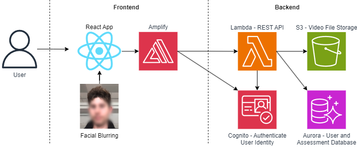

# Dropzone

The easy-to-use video assessment platform.

## High Level Architecture

### Database Design

## Deployment Guide

To deploy this solution, please follow the steps laid out in the [Deployment Guide](docs/DeploymentGuide.md)

## [Demo Video](guide_videos/Demo%20Video.mp4)

https://github.com/UBC-CIC/Streaming-Video-Assessment/assets/29736701/3066ade2-3c92-4f91-aa2a-ee858ab75db6

## Files And Directories

1. `/frontend/amplify/backend/function/api/src`: Contains all the backend code
    1. `/frontend/amplify/backend/function/api/src/sequelize/models`: Contains database models
1. `/frontend/src`: Contains all frontend React code
1. `/docs`: Contains relevant documentation files

## Future Considerations

* Video Editing Option: Our platform does not an option for video editing, which can make the process of recording long videos require many attempts. A post-recording review page, where uploaders can edit and manage their submission, may be able to solve this pain point.

* Platform Manager Workflow: The Platform Manager concept extends could be the school’s IT admins who manage permissions of users. The could also invite teachers to the platform, since currently anyone can create an assessment creator account.

* Improved recording performance: We've noticed on some older devices the uploader recording page can be painfully slow. Perhaps older devices could detected and we could limit certain features (such as face blurring) to improve performance on those devices.

## License

This project is distributed under the [MIT License](LICENSE)
